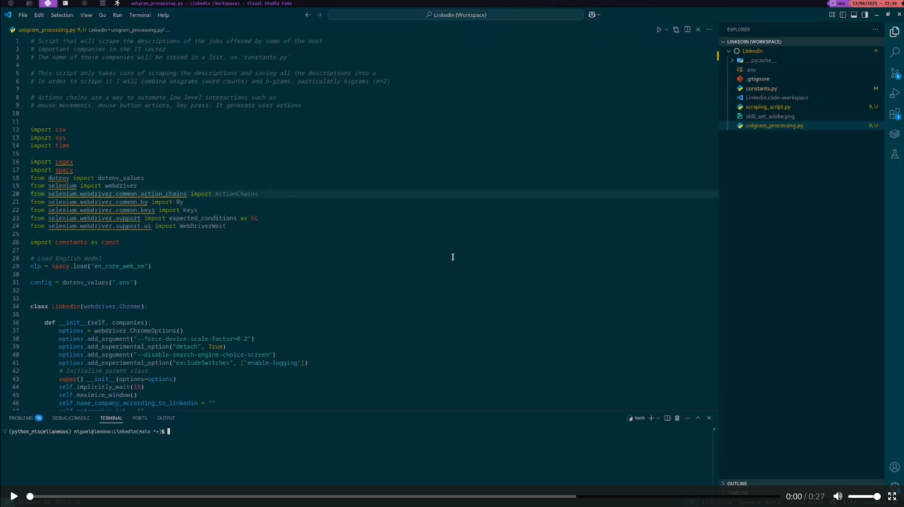

# SCRAPING JOBS SKILLS LINKEDIN
<!-- TOC --> 
- [SCRAPING JOBS SKILLS LINKEDIN](#scraping-jobs-skills-linkedin)
    - [1. Motivation of this project](#1-motivation-of-this-project)
    - [2. Arguments used on Linkedin search](#2-arguments-used-on-linkedin-search)
      - [2.1 Location](#21-location)
      - [2.2. Title](#22-title)
      - [2.3 Companies considered for scraping their job descriptions](#23-companies-considered-for-scraping-their-job-descriptions)
    - [3. Implementation](#3-implementation)
    - [4. Explanation of new things](#4-explanation-of-new-things)
    - [5. Considerations](#5-considerations)
    - [6. Gotchas](#6-gotchas)
    - [7. Conclusions](#7-conclusions)
    - [8. Usage](#8-usage)
    - [9. Video](#9-video)
 <!-- /TOC -->
### 1. Motivation of this project
+ Nowadays, June of 2025, **Linkedin is the most popular job platform**. Most companies publish their job offers on Linkedin, as well as in their own companies specific portals, and some other portals as well. 
+ After finishing the first year of the master I am currently doing (2025), and with the summer around the corner I am reorganizing my study routine.
+ The master I am doing, is primarily focused on the technical side of the mathematics behind Machine Learning, Deep Learning, Data Science... (optimization, statistics, calculus, linear algebra). So, mainly we have seen mathematics, and also some software (Python, R, Tensorflow, MATLAB, AMPL, JupyterLab, Colab...).
  + I am very happy with the way the master is planned, I really wanted to go deeper beyond calling some function, class from scikit-learn, Tensorflow or whatever, and suddenly magic happens.  
+ Having said that, I am aware that we have not seen a lot about technologies that are frequently used in the field of ML/AI (everything related to the cloud, containerization, other programming languages, workflows...)
+ So, before starting to learn, I want to **check the most demanded skills in the ML/AI. In order to do so**, it seems a good idea to **check the descriptions of the jobs offered by important companies in the field**. Once I know the most important skills, I can address which one's learn first and consequently organize my study routine.
### 2. Arguments used on Linkedin search
#### 2.1 Location
+ **United States** is considered the best country in IT field. So makes sense to restrict the search to that location.
#### 2.2. Title
+ Basically I wanted to check jobs in the ML/AI field. After a bit of trial and error, searching jobs with the term **Machine Learning** gave the best results.
#### 2.3 Companies considered for scraping their job descriptions
+ Not big deal. All of them are well-known, and after a bit of search on internet I came up with the the following list.
```py
  ENTERPRISES = [
    "Google",
    "Google DeepMind",
    "Microsoft",
    "Amazon",
    "Amazon Web Services (AWS)",
    "Meta",
    "NVIDIA",
    "OpenAI",
    "Salesforce",
    "Adobe",
    "IBM",
    "Palantir Technologies",
    "Databricks",
    "Tesla",
    "Abbott",
  ]
```
### 3. Implementation
+ Python
+ Selenium (scrape)
+ Regex (parse)
+ Spacy (POS tagger)

+ **Source code**:
  + `scraping_script.py`: Script that scrapes the jobs descriptions and save them on a txt. This is the longer and hardest script. Contains all the logic to sign in, and search the jobs for each company.
  + `constants.py`: File that contains some constants used by the scripts (title, location, companies and linkedin url)
  + `unigram_processing.py`: Script that process the scraped info. Particularly does it considering unigrams (words) as tokens.
  + `bigram_processing.py`: Scriot that process the scraped info.
  Particularly does it considering bigrams (2 consecutive words) as tokens.
+ **Output files**:
  + `description_jobs.txt`: File that contains the descriptions of all scraped jobs. Each line corresponds to the description of a job.
  + `Linkedin_unigrams.csv`: File that contains the frequency of unigrams (only nouns). Sorted in descendant order by frequency
  + `Linkedin_bigrams.csv`: File that contains the frequence of bigrams. Sorted in descendant order by frequencey
### 4. Explanation of new things
+ **POG tagging**: Given a word, assign a tag.
  + NOUN: common noun
  + PROPN: proper noun
  + ...
   
+ **spaCy**: NLP library
  + Particularly on this case I am interested on its Part-Of-Speech (POS) tagger functionality
  + **Motivation**: Once I got my word-frequency data in a dictionary, I was only interested in the nouns (Python, hpc, Docker...)
  + The model **en_core_web_sm** is a separate package that I need to download separately.
  + It is a trained machine learning model. 
  + Can predict various linguistic annotations (one of those POG tagging)
  + ```py
    # nlp: Loaded spaCy model
    # Even if word is just a single word, spaCy still processes it as a document
    # The result doc is a container that holds the processed text (tokenized)
    doc = nlp(word) 
    for token in doc:
    # Each token has a property  pos_ which is the POS tag as a string
        if token.pos_ in ("NOUN", "PROPN")
    
    rest of code...
    ```
### 5. Considerations
1. For simplicity I only **use the jobs that appeared on the first page** for each company. 
   + Each page can contain up to 25 jobs.
   + Because many companies are scraped (+10 companies), I considered enough to scrape just up to 25 jobs per company, to get a sense of the demanded skills.
2. The script **can be customized to search for jobs in any location, for any companies and for any terms (title)**.
   + In order to customize it modify `constants.py`.
### 6. Gotchas
1. **Linkedin asks to solve a puzzle when script is executed repeteadly on the same day**:
   1. First point:
   + Script was executed many times during development process. 
   + Once development process is finished, it will only be needed to run the script once.
     + So, we won't have that problem and *Linkedin wont prompt us with a puzzle*.
   + Example: The script could be executed with a frequency of once per 3 months, to detect changes in the skills required on a given industry.
   1. Second point:
   + Even so, having the problem of the puzzle is not a big deal for the execution of the script.
       1. Execute the script
       2. When Linkedin prompt us to solve the puzzle, we can solve it manually
       3. Let the script continue its execution. 
2. **Manually zoom out for proper execution**
   1. Execute script
   2. After getting jobs results for our search, we **zoom out** until all jobs fit on our window. 
      + **Linkedin loads the jobs as we scroll down**. 
      + Zooming out, we force Linkedin to load all jobs at once.
### 7. Conclusions
+ We have to bear in mind that likely not all the jobs will be closely related with my field (ML/AI, Data Science). 
  1. I search by the term **Machine Learning**
  2. Could happen that some job has that term on its description but is not closely related to my field
  3. Example: I spot a job that asked for an economist able to understand the economical impacts that the machine learning could have
+ For simplicity, **I would assume that the most frequent mentioned skills across ALL jobs** (related and not so closely related) **could be a relevant skill for my field/industry**.
+ Reminder about my *Linkedin search*:
```py
ENTERPRISES = [
    "Google",
    "Google DeepMind",
    "Microsoft",
    "Amazon",
    "Amazon Web Services (AWS)",
    "Meta",
    "NVIDIA",
    "OpenAI",
    "Salesforce",
    "Adobe",
    "IBM",
    "Palantir Technologies",
    "Databricks",
    "Tesla",
    "Abbott",
]
TITLE = "Machine Learning"
LOCATION = "United States"
```
+ On date June of 2025, the **most relevant skills according my Linkedin search** are (unigrams and bigrams):


Among all this things I can differentiate between:
+ **Things I have already learned**: *Python, ml, tensorflow, pytorch, database, genai, javascript, ai, deep learning, operations research, natural language*
+ **Things I have not learned yet**: *cloud, databrics, aws, spark, c++, apache, kubernetes, scala, ci/cd*

### 8. Usage
0. Create and activate a virtual environment
```bash
  python3 -m venv venv
  source venv/bin/activate
```
1. Install dependencies
```bash
  pip install -r requirements.txt
```
2. Customize `constants.py` (choose enterprises, title and location of your preference)
3. Create a `.env` with your environment variables 
   1. MY_SECRET_ACCOUNT: Your linkedin account
   2. MY_SECRET_PASSWORD: Your linkedin password
4. Execute the scraping script: `python scraping_script.py`
5. Execute the unigram process script: `python unigram_processing.py`
6. Execute the bigram process script: `python bigram_processing.py`
7. Analyze `Linkedin_unigrams.csv` and `Linkedin_bigrams.csv`

### 9. Video
+ Small video showing the correct execution of the project, particularly of the `scraping_script.py`
[](https://github.com/user-attachments/assets/9c622ea2-34d3-4b56-82a4-e88b4b1b134b)

